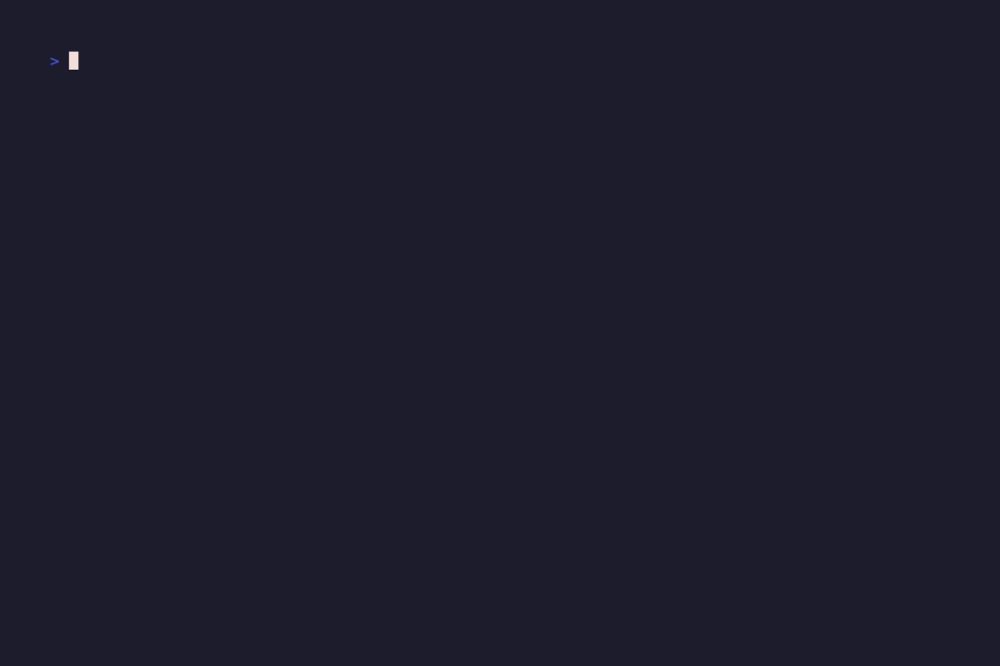
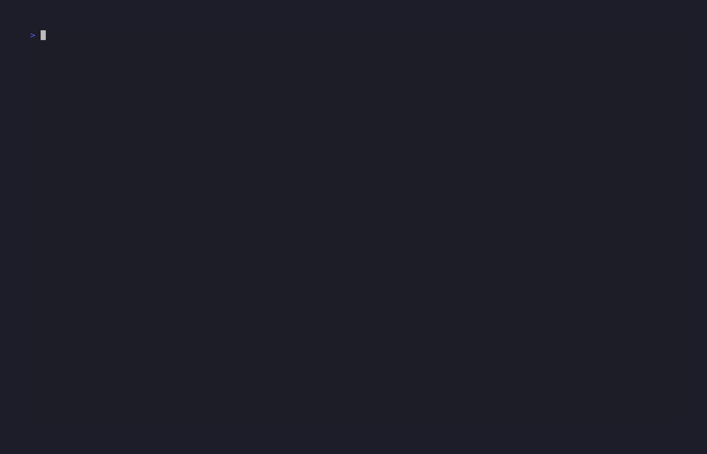

# 🦅 HawkTUI

**A comprehensive Terminal UI toolkit for building beautiful, interactive terminal applications in Go.**

## What is HawkTUI?

HawkTUI is a batteries-included UI toolkit for Go terminal applications, combining the best features of [lipgloss](https://github.com/charmbracelet/lipgloss), [bubbletea](https://github.com/charmbracelet/bubbletea), and [log](https://github.com/charmbracelet/log) into one cohesive package with ready-to-use templates.

## Features

### 🎨 **Theme System**
- 5 built-in themes (Dark, Light, Nord, Dracula, Catppuccin)
- Full color customization
- Consistent styling across components

### 🧩 **Rich Component Library**
- **Button** - Multiple styles (Primary, Secondary, Success, Warning, Error, Ghost)
- **Input** - With validation, password masking, and callbacks
- **Table** - Selectable rows, auto-sizing, keyboard navigation
- **List** - Filterable with search and descriptions
- **ProgressBar** - Customizable with labels and percentages
- **Spinner** - 5 animation styles
- **Panel** - Bordered containers with titles
- **Tabs** - Tabbed interface with keyboard navigation

### 📐 **Flexible Layouts**
- Horizontal & Vertical layouts
- Grid layout (n columns)
- Flexbox-style layouts
- Container with alignment and spacing

### 📝 **Structured Logger**
- 5 log levels (Debug, Info, Warn, Error, Success)
- Styled output with theme colors
- Entry history tracking

### 📦 **Pre-built Templates**
- **Dashboard** - Multi-widget grid layout
- **Form** - Field management with validation
- **ListView** - Search bar and action buttons
- **SplitView** - Horizontal/vertical split panes

## Quick Start

### Installation

\`\`\`bash
go get github.com/hawk-tui/hawk-tui/pkg/hawktui
\`\`\`

### Basic Example

\`\`\`go
package main

import (
    "fmt"
    "os"

    tea "github.com/charmbracelet/bubbletea"
    "github.com/hawk-tui/hawk-tui/pkg/hawktui"
    "github.com/hawk-tui/hawk-tui/pkg/hawktui/components"
)

type model struct {
    app    *hawktui.App
    button *components.Button
}

func (m model) Init() tea.Cmd { return nil }

func (m model) Update(msg tea.Msg) (tea.Model, tea.Cmd) {
    switch msg := msg.(type) {
    case tea.KeyMsg:
        if msg.String() == "q" {
            return m, tea.Quit
        }
    }

    btnModel, cmd := m.button.Update(msg)
    m.button = btnModel.(*components.Button)
    return m, cmd
}

func (m model) View() string {
    return m.button.View()
}

func main() {
    app := hawktui.New(hawktui.WithTheme(hawktui.ThemeDark()))

    button := hawktui.NewButton("Click Me!", func() {
        app.Logger().Success("Button clicked!")
    })
    button.SetTheme(app.Theme())
    button.SetFocused(true)

    m := model{app: app, button: button}
    p := tea.NewProgram(m, tea.WithAltScreen())
    if _, err := p.Run(); err != nil {
        fmt.Printf("Error: %v\n", err)
        os.Exit(1)
    }
}
\`\`\`

## Demos

See HawkTUI in action with our animated demos created using [VHS](https://github.com/charmbracelet/vhs):

### Simple Demo

Basic components including button, input field, and spinner with focus management.

### Dashboard Demo

Dashboard template with metrics, status indicators, and charts.

### Form Demo

Form validation, field navigation, and submit handling.

### List Demo

List component with navigation, filtering, and item selection.

**Want to generate these demos yourself?** See [demos/README.md](demos/README.md) for instructions on using VHS to create these recordings.

## Examples

The \`examples/hawktui/\` directory contains complete examples:

\`\`\`bash
# Simple component demo
go run examples/hawktui/simple_demo.go

# Dashboard with metrics
go run examples/hawktui/dashboard_demo.go

# Form with validation
go run examples/hawktui/form_demo.go

# List view with search
go run examples/hawktui/list_demo.go
\`\`\`

## Components

### Button

\`\`\`go
button := hawktui.NewButton("Submit", func() {
    // Handle click
})
button.SetStyle(components.ButtonStylePrimary)
button.SetFocused(true)
\`\`\`

### Input

\`\`\`go
input := hawktui.NewInput("Enter your name...")
input.SetMaxLength(50)
input.SetOnChange(func(value string) {
    // Handle change
})

// Password input
input.SetMasked(true)

// With validation
input.SetValidator(func(value string) bool {
    return len(value) >= 3
})
\`\`\`

### Table

\`\`\`go
table := hawktui.NewTable([]string{"Name", "Age", "Email"})
table.SetRows([][]string{
    {"Alice", "30", "alice@example.com"},
    {"Bob", "25", "bob@example.com"},
})
table.SetOnSelect(func(row int) {
    // Handle selection
})
\`\`\`

### Dashboard Template

\`\`\`go
app := hawktui.New(hawktui.WithTheme(hawktui.ThemeDracula()))

dashboard := templates.NewDashboardWithTheme(app.Theme())
dashboard.SetTitle("System Dashboard")
dashboard.SetColumns(3)

dashboard.AddWidget(templates.CreateMetricWidget(
    "CPU Usage", "45%", "8 cores", app.Theme(),
))

dashboard.AddWidget(templates.CreateStatusWidget(
    "Server", "healthy", "All systems operational", app.Theme(),
))
\`\`\`

## Documentation

- [HawkTUI Toolkit README](pkg/hawktui/README.md) - Complete toolkit documentation
- [API Design](API_DESIGN.md) - Protocol and architecture design
- [Contributing Guide](CONTRIBUTING.md) - How to contribute

## Project Structure

\`\`\`
hawk-tui/
├── pkg/hawktui/          # Main UI toolkit package
│   ├── components/       # UI components
│   ├── layouts/          # Layout helpers
│   ├── logger/           # Styled logging
│   ├── styles/           # Theme system
│   └── templates/        # Pre-built templates
├── examples/
│   ├── hawktui/          # Toolkit examples
│   ├── go/               # Go protocol examples
│   ├── python/           # Python client examples
│   └── nodejs/           # Node.js client examples
├── internal/             # Internal TUI components
├── cmd/                  # Command-line applications
└── docs/                 # Documentation
\`\`\`

## Building

### Build the Examples

\`\`\`bash
# Build all HawkTUI examples
go build -o bin/simple_demo examples/hawktui/simple_demo.go
go build -o bin/dashboard_demo examples/hawktui/dashboard_demo.go
go build -o bin/form_demo examples/hawktui/form_demo.go
go build -o bin/list_demo examples/hawktui/list_demo.go
\`\`\`

### Using Docker

\`\`\`bash
# Build Docker image
docker build -t hawktui .

# Run an example
docker run -it hawktui
\`\`\`

## Testing

\`\`\`bash
# Run all tests
go test ./...

# Run tests with coverage
go test -cover ./...

# Run tests for the HawkTUI package
go test ./pkg/hawktui/...
\`\`\`

## License

HawkTUI is dual-licensed under:

- **AGPL-3.0**: Free for open source and personal use
- **Commercial License**: Required for proprietary/commercial use

See [LICENSE](LICENSE) file for details.

## Acknowledgments

HawkTUI is inspired by the excellent work of Charmbracelet:
- [lipgloss](https://github.com/charmbracelet/lipgloss) - Terminal styling
- [bubbletea](https://github.com/charmbracelet/bubbletea) - TUI framework
- [bubbles](https://github.com/charmbracelet/bubbles) - TUI components
- [log](https://github.com/charmbracelet/log) - Structured logging

## Contributing

Contributions are welcome! Please see [CONTRIBUTING.md](CONTRIBUTING.md) for details.

## Links

- **Documentation**: [pkg/hawktui/README.md](pkg/hawktui/README.md)
- **Examples**: [examples/hawktui/](examples/hawktui/)
- **Demos**: [demos/README.md](demos/README.md)
- **Issues**: https://github.com/RyanSStephens/hawk-tui/issues

---

**Transform your CLI tools into beautiful, interactive experiences.**
